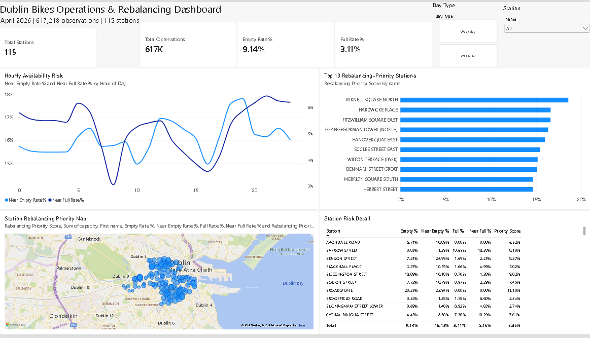
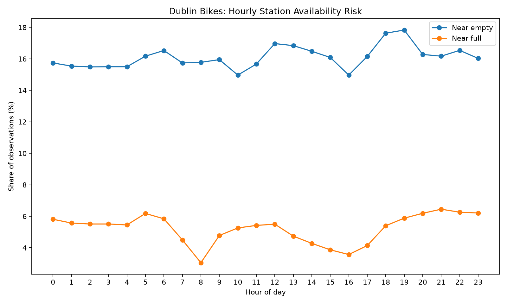
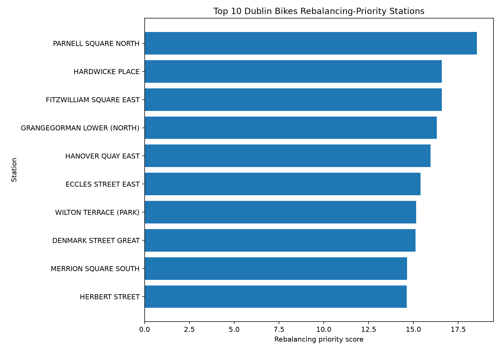

# Dublin Bikes Operations Analytics

**Python | SQL | Power BI | Data Preprocessing | Operational Analytics**

## Project Overview

Dublin Bikes is a docked bike-sharing system operating across Dublin city. A station can become difficult for customers to use when it is repeatedly **empty** (no bikes available) or **full** (no docks available).

This portfolio project analyses historical Dublin Bikes station-status data to identify availability patterns, operational pressure points, and potential bike-rebalancing opportunities.

The project demonstrates an end-to-end Data Analyst workflow:

**Raw open data → Data cleaning & validation → Feature engineering → SQLite/SQL analysis → Operational scoring → Visualisation → Power BI dashboard → Business recommendations**

## Business Problem

> How can Dublin Bikes use historical station availability data to identify stations at risk of becoming empty or full, understand peak demand patterns, and prioritise bike-rebalancing activity?

## Power BI Dashboard



The interactive dashboard provides:

- Network-level KPI cards for stations, observations, empty rate and full rate
- Hourly near-empty and near-full risk trends
- Top 10 rebalancing-priority station ranking
- Geographic station-priority mapping across Dublin
- Station-level risk detail
- Interactive weekday/weekend and station filters

**Power BI file:** [Open the `.pbix` file](dashboard/dublin_bikes_operations_dashboard.pbix)

## Dataset Snapshot

- **617,218** cleaned station-status observations
- **115** unique stations
- Analysis period: **1 April 2026 to 1 May 2026**
- **0** duplicate rows
- **0** missing timestamps, station IDs or capacity values
- **100%** of observations recorded while stations were active for both renting and returning
- **8,093** observations (**~1.31%**) flagged for capacity-consistency review

## Key Findings

- **Fitzwilliam Square East** was near empty in **44.32%** of observations, the highest near-empty rate among analysed stations.
- **Parnell Square North** showed severe bike-availability pressure, with **36.38% empty** and **37.27% near-empty** observations.
- **Heuston Bridge (North)** had the highest near-full rate at **20.66%**.
- **Heuston Bridge (South)** showed strong dock pressure, with **25.22% full** and **18.13% near-full** observations.
- Network-wide near-empty pressure was highest around **18:00–19:00**.
- Weekend observations showed higher near-empty and near-full rates, while weekdays recorded a higher outright empty-station rate.
- Operational-status validation confirmed that the identified pressure patterns were not caused by stations being unavailable for renting or returning.

## Business Recommendations

Based on the April 2026 station-status observations:

1. **Prioritise bike replenishment at persistent shortage stations**, especially Parnell Square North, Hardwicke Place, Fitzwilliam Square East and Grangegorman Lower (North).
2. **Prioritise dock clearance at persistent full-station locations**, particularly the Heuston area, where both Heuston Bridge stations showed substantial dock pressure.
3. **Schedule additional rebalancing attention before the evening risk peak**, with near-empty pressure strongest around 18:00–19:00.
4. **Use station-specific rather than network-wide rebalancing rules.** The analysis shows that some locations primarily experience bike shortages while others primarily experience dock shortages.
5. **Monitor capacity-consistency exceptions separately** so operational decisions are not distorted by the small subset of observations requiring additional data-quality review.

These recommendations identify operational priorities from historical station-status patterns; they do not imply observed trip-level causality because the dataset records station availability rather than individual journeys.

## Key Visualisations

### Hourly Near-Limit Availability Risk



Near-empty risk remains materially higher than near-full risk across the network, with the strongest near-empty pressure occurring during the evening period.

### Top Rebalancing-Priority Stations



The rebalancing score combines empty, near-empty, full, near-full and peak-period behaviour to identify stations requiring the greatest operational attention.

## Business Questions

1. Which stations most frequently experience very low bike availability?
2. Which stations most frequently approach full capacity?
3. What hours and days create the greatest availability pressure?
4. How do weekday and weekend patterns differ?
5. Which stations show the strongest morning and evening demand patterns?
6. Which stations should receive the highest rebalancing priority?
7. How can these findings be communicated through an executive Power BI dashboard?

## Data Source

**Publisher:** Dublin City Council / Smart Dublin  
**Dataset:** Dublinbikes API DCC – Historical Station Data  
**Licence:** Creative Commons Attribution 4.0 (CC BY 4.0)  
**Portal:** https://data.gov.ie/en_GB/dataset/dublinbikes-api  

The source provides historical station-status observations including station identifiers, timestamps, station capacity, available bikes, available docks and location information. Raw source files are intentionally not committed to this repository; the project keeps the analysis reproducible while avoiding large raw-data files in GitHub.

## Tools & Skills Demonstrated

### Python
- Pandas
- NumPy
- Data cleaning
- Missing-value checks
- Duplicate detection
- Data-type conversion
- Feature engineering
- Data-quality validation
- Exploratory analysis
- Matplotlib visualisation

### SQL / SQLite
- CTEs
- `CASE WHEN`
- Aggregations
- Date/time analysis
- Window functions
- `LAG()`
- `ROW_NUMBER()`
- Ranking
- Operational KPI calculations
- Rebalancing-priority scoring

### Power BI
- Power Query
- Data modelling
- DAX measures
- KPI cards
- Interactive slicers
- Time-series analysis
- Station-level drill-down
- Geographic mapping
- Operational dashboard design

## Analysis Workflow

1. Download official Dublin Bikes historical station-status data.
2. Profile the raw dataset and document data-quality issues.
3. Clean and validate station, timestamp, capacity and availability fields in Python.
4. Engineer analytical features including hour, weekday/weekend, time period, availability percentages and operational-risk flags.
5. Export the cleaned analytical dataset.
6. Load **617,218** processed observations into SQLite.
7. Use SQL to analyse network performance, station-level risk, hourly patterns and rebalancing priorities.
8. Validate that high-risk station observations occurred while stations were operational.
9. Generate portfolio visualisations from SQL results.
10. Build an interactive Power BI operations dashboard and translate the analysis into practical rebalancing recommendations.

## Repository Structure

```text
dublin-bikes-operations-analytics/
├── README.md
├── requirements.txt
├── .gitignore
├── data/
│   └── README.md
├── python/
│   ├── preprocess_dublin_bikes.py
│   ├── load_to_sqlite.py
│   ├── run_sql_analysis.py
│   ├── run_station_risk_analysis.py
│   ├── run_temporal_priority_analysis.py
│   ├── validate_operational_status.py
│   └── create_portfolio_visuals.py
├── sql/
│   └── analysis_queries.sql
├── dashboard/
│   ├── README.md
│   └── dublin_bikes_operations_dashboard.pbix
├── docs/
│   ├── project_plan.md
│   ├── data_dictionary.md
│   ├── validated_findings.md
│   ├── temporal_priority_findings.md
│   └── operational_validation.md
└── images/
    ├── hourly_availability_risk.png
    ├── top_rebalancing_priority_stations.png
    └── power_bi_dashboard.png
```

## Data Quality Note

A small subset of observations was flagged for station-capacity consistency review. These records are documented transparently and retained for further sensitivity checking rather than silently removed. The major station-risk findings were separately validated against the renting and returning service-status fields.

## Project Status

✅ **Complete — Python preprocessing, SQL analysis, operational validation, visualisation and interactive Power BI dashboard delivered.**

## Author

**Antony Pereira George**  
Dublin, Ireland  
Data Analyst | SQL | Python | Power BI

---

*This project uses publicly available Dublin City Council / Smart Dublin data and is intended for educational and portfolio purposes.*
